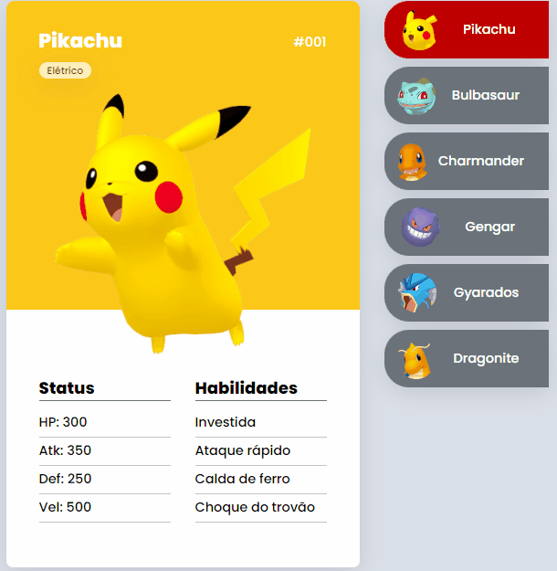
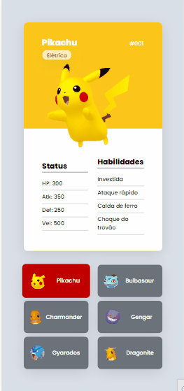

# Mini Pokedéx

[]

[]

## Descrição
Uma pequena lista de cartões pokémon utilizando recursos básicos de desenvolvimento front-end.

O projeto foi adicionado ao curso DEVQUEST após a mapa-devweek de julho de 2022, uma semana de imersão em conceitos básicos do front-end para que, tanto devs experiêntes (que quisessem participar), quanto devs iniciantes tivessem um projeto prático para contribuir com o seu github.

## Tecnologias utilizadas

- HTML
- CSS
- JS

## Conceitos aprendidos durante o projeto

- Responsividade;

- Recursos de display;

- Unidades de medida px e vh;

- Recursos hover e transition;

- Esconder e mostrar itens na tela utilizando JS básico;

- Transferência de classes html através de JS;

- Hospedagem de páginas utilizando o Github pages;

## Conclusão

Apesar de ter sido pensado para que fosse uma página extremamente simples, esse projeto utiliza  muitos conceitos básicos que são de grande importância para a formação profissional de um desenvolvedor iniciante.

Conceitos e desafios que provavelmente o desenvolvedor estagiário, ou júnior irá encontrar no dia-a-dia do início da sua carreira, e serviu não só como um primeiro desafio, mas também como um instrumento de motivivação para que eu tivesse a certeza que essa é a carreira que eu quero seguir! 